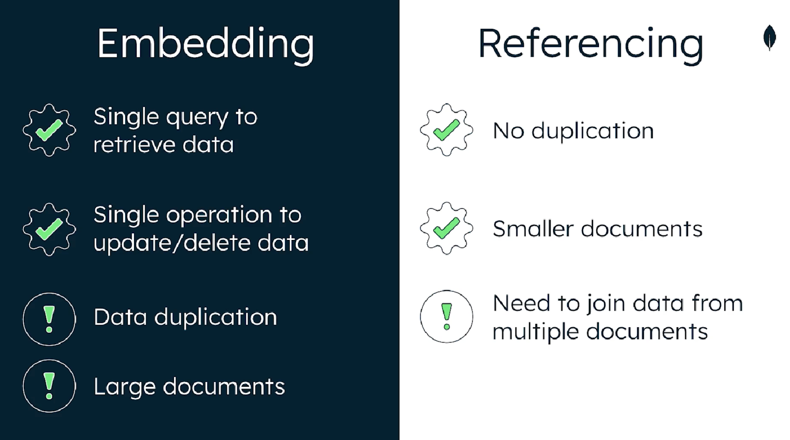

# Unit 4 - MongoDB Data Modeling Intro

## Lesson 1 - Introduction to data modeling

Data modeling is the process of defining how data is stored and the relationships that exist among different entities in your data.

Organization of data inside the database is called schema. It’s good to think about the application rather than the database itself to model it.

It could be good to answer next questions: What does my application do? What data will I store? How will users access this data? What data will be most valuable to me?

A good data model can (benefits):
* Make it easier to manage data
* Make queries more efficient
* Use less memory and CPU
* Reduce costs

Key principle in MongoDB: “Data that is accessed together, should be stored together”

MongoDB implements a flexible document data model. Documents in the same collection could have different structure. Those different documents in the same collection is called polymorphism. MongoDB isn’t schemaless, it’s schema flexible. You can define your own schema to validate documents.

We can embed documents. Embedded document model enables us to build complex relationships among data. You can normalize your database by using references to another collection/document.

Comparing Mongo with relational database, relational database designs data structure first, and the application use it. In MongoDB we should be focused on the application first, and the model stored in MongoDB should be similar to the one managed in the application.

The main goal of data modeling is: store, query and use resources optimally.

## Lesson 2 - Types of data relationships

There are three type of relationships: One-to-one, One-to-many and Many-to-many
There are two main ways to model relationships: Embedding and Referencing

**One-to-One**
A relationship where a data entity in one set is connected to exactly one data entity in another set.
In MongoDB we could have this relationship in a single document.

**One-to-Many**
A relationship where a data entity in one set is connected to any number of data entities in another set.
In MongoDB we could have this relationship nesting embedded object in an array. Advantage, in one query you could have the main element, plus all the related ones.

**Many-to-Many**
A relationship where any number of data entities in one set are connected to any number of data entities in another set.

**Embedding**
We take related data and insert it into our document.

**Referencing**
We refer to documents in another collection in our document.

## Lesson 3 - Modeling Data Relationships

This lesson will be driven by an example. It’s just an example providing One-to-many relationship built using embedding and another one using referencing.

## Lesson 4 - Embedding data in documents

Embedding is used to model one-to-many or many-to-many relationships in the data that’s being stored. Embedded document also known nested document.
This solution encourage data accessed together is stored together.
Embedding strategy comes with several advantages:

* Avoids application joins.
* Provides better performance for read operations.
* Allows developers to update related data in a single write operation.

Even it has several warnings to be considered when embedding documents strategy is followed:

* Data into a single document can create large documents. It could lead excessive memory usage and latency for read operations.Large documents have to be read into memory in full, which can result in a slow application performance for your end user.
* Continuously adding data without limit creates unbounded documents. It could exceed BSON document threshold of 16MB.

Both warning is driven anti-pattern usages of MongoDB. More info about MongoDB anti-patterns in MongoDB documentation.

## Lesson 5 - Referencing data in documents

To relate documents between collections we could use references. References save _id field of one document in another as a link between the two documents.
This mechanism is simple and enough for most of the cases. Using this kind of links is called linking or data normalization.

Referencing advantages:

* No duplication of data.
* Smaller documents.

Warnings:

* This solution implies queuing from multiple documents costs extra resources and impacts read performance.

## Lesson 6 - Scaling a data model

Data model looking for efficiency should take into consideration optimum of:

* Query result times
* Memory usage
* CPU usage
* Storage

First of all, we have to avoid unbounded documents (size grows infinitely). This kind of documents take up more space in memory. Furthermore, it will impact in write performance because the entire document is rewritten. Difficult to implement any kind of pagination mechanism if we have an array property with all the comments, the example provided in the video was a blog post with an array with all the comments. Last point to be considered is the maximum document size of 16MB.

With data modeling we have to avoid:

* More than the document size limit of 16MB.
* Poor query performance.
* Poor write performance.
* Too much memory being used.

## Lesson 7 - Using Atlas tools for schema help

Schema design patterns are guidelines that help developers plan, organize and model data. When application is designed using anti-patterns those are the results:

* Sub-optimal performance
* Non-scalable solutions

The most common anti-patterns are:

* Massive arrays
* Massive number of collections
* Bloated documents
* Unnecessary indexes
* Queries without indexes
* Data that’s accessed together, but stored in different collections.

It’s not easy to identify them, but Atlas provides tools to identify them: Data Explorer and Performance Advisor.

Data Explorer is available since the free tier. In the indexes tab, it’s show it’s usage, and it could removed unnecessary indexes. Schema anti-patterns tab will show a list of anti-patterns identified and actions to be done to fix it.

Performance Advisor can tell us which indexes are redundant. It needs M10 tier or bigger. This tool provide information about the most active collections to improve them. Even it detects collections with slow-running queries. Performance Advisor has three different sections:

* Index creation (suggestion for index creation).
* Drop index (suggestion for index removal).
* Improve schemas (recommendations to improve the schema).

